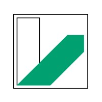

<h1 align="center">Physikalisches Praktikum B2</h1>

  

## Einleitung
Dieses Repository enthält mehrere Auswertung und Daten zu den Versuchen im Bachelor Physik an der Universität Bayreuth in Rahmen des Fortgeschrittenen Physikalischen Praktikum B2 geführt von ``Dr. Uwe Gerken``.

Die Auswertungen dienen zur **Hilfe** und sollen nicht die Eigenleistung erleichtern. Deswegen weise ich darauf hin selbst Arbeit in **seine** Auswertungen zu stecken und die Fragen zur Vorbereitung **gewissenhaft** zu erledigen, da sie **notwendig** sind für das Verständnis zum jeweiligen Versuch.

## Legende

| Nr | Gruppenmitglieder                                                   |  Jahr     |
|:--:|:------------------------------------------------------------------------------------|:---------:|
| 5  | [Manuel Lippert](https://github.com/ManeLippert), Paul Schwanitz                    |   2021    |
| 6  | Anna-Maria Pleyer, Dominik Müller, (David Stadelmann bei FRET)                      |   2021    |
| 7  | Konstantin Rausch, Lydia Ploss                                                      |   2021    |
| 8  | Charlotte Geiger, Leonie Auer                                                       |   2021    |
| 9  | Leonhard Schatt, Matteo Kumar                                                       |   2021    |
| 10 | Emma Rauland, Anna-Lena Vesper                                                      |   2021    |
| 11 | Johanna Lix, Jonas Elschner                                                         |   2021    |
| 12 | Emmi Gareis, Magdalena Dörfler                                                      |   2020    |
| 13 | Clara Gremmelspacher, Sebastian Koch                                                |   2020    |

## Versuche

|  | Beschreibung                                                |  Gruppen  |
|:-------:|:------------------------------------------------------------------------------------|:-----------:|
| AFM     | Rasterkraftmikroskop                                                                | [9](/Versuch_AFM/Leo_Matteo/Versuch_AFM.pdf) |
| AGS     | Alpha-Gamma Spektroskopie                                                           | [9](/Versuch_AGS/Leo_Matteo/Versuch_AlphaGamma.pdf) |
| Chaos   | Chaos in physikalischen Systeme                                                     | [5](/Versuch_Chaos/Manuel_Paul/Versuch_Chaos.pdf) |
| DSR     | Dopplerfreie Spektroskopie von Rubidium                                             | [5](/Versuch_DSR/Manuel_Paul/Experiment_DSR.pdf), [6](/Versuch_DSR/Anna-Maria_Dominik/Master.pdf), [7](/Versuch_DSR/Konstantin_Lydia_DSR_Gruppe7.pdf), [10](/Versuch_DSR/Emma_Anna-Lena/), [12](/Versuch_DSR/Emmi_Magdalena/DSvR.pdf) |
| FRET    | Förster-Resonanzenergietransfer an bilogischen Proben                               | [5](/Versuch_FRET/Manuel_Paul/Versuch_FRET.pdf), [6](/Versuch_FRET/Anna-Maria_David_Dominik/Master.pdf), [9](/Versuch_FRET/Leo_Matteo/Versuch_FRET.pdf) |
| FTS     | Fouriertransformationsspektroskopie                                                 | [6](/Versuch_FTS/Anna-Maria_Dominik/Master.pdf), [8](/Versuch_FTS/Charlotte_Leonie/FTS_Charlotte_bearbeitet.pdf) |
| Laser   | Laser als Messgerät                                                                 | [6](/Versuch_Laser/Anna-Maria_Dominik/Master.pdf), [9](/Versuch_Laser/Leo_Matteo/Versuch_Laser.pdf), [11](/Versuch_Laser/Johanna_Jonas/Laser_Auswertung.pdf) |
| Raman   | Raman-Spektroskopie                                                                 | [6](/Versuch_Raman/Anna-Maria_Dominik/Master.pdf), [8](/Versuch_Raman/Charlotte_Leonie/Raman_Charlotte.pdf), [13](/Versuch_Raman/Clara_Sebastian/Raman_Clara.pdf) |
| REM     | Rasterelektronenmikroskop                                                           | [5](/Versuch_REM/Manuel_Paul/Verbesserung_REM.pdf) |
| SRV     | Signal-Rausch Verbesserung                                                          | [5](/Versuch_SRV/Manuel_Paul/Versuch_SRV.pdf) |
| SZ      | Solarzelle                                                                          | [9](/Versuch_SZ/Leo_Matteo/Versuch_Solarzelle.pdf) |

## Schluss

Viel Erfolg im Praktikum und weiteren Verlauf im Bachelor!